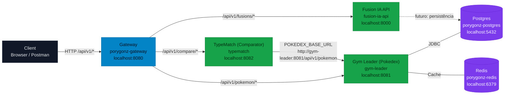

# microservices-infra

Infra local (Docker Compose) para rodar:
- porygonz-gateway
- microservices-gym-leader
- microservices-typematch
- Postgres
- Redis

## Estrutura esperada
Clone os repositórios no mesmo diretório pai:

```
/projetos
  /microservices-infra
  /porygonz-gateway
  /microservices-gym-leader
  /microservices-typematch
```

## Como rodar
No Windows PowerShell (com Docker Desktop rodando):

```bash
cd microservices-infra
copy .env.example .env
docker compose up -d --build
```

## Endpoints
Gateway: `http://localhost:8080`

- `GET /api/v1/pokemon/{idOrName}` -> gym-leader
- `GET /api/v1/compare/{id1}/{id2}` -> typematch
- `GET /api/v1/fusions` -> fusion-ai-api

## Logs
```bash
docker compose logs -f gateway
docker compose logs -f typematch
docker compose logs -f gym-leader
```

## Reset total (containers + volume do Postgres)
```bash
docker compose down -v
```

## Arquitetura (visão técnica)

